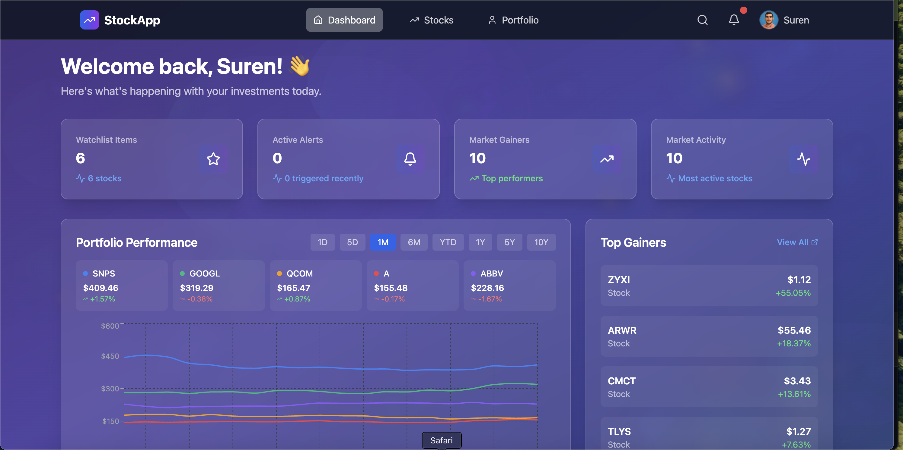
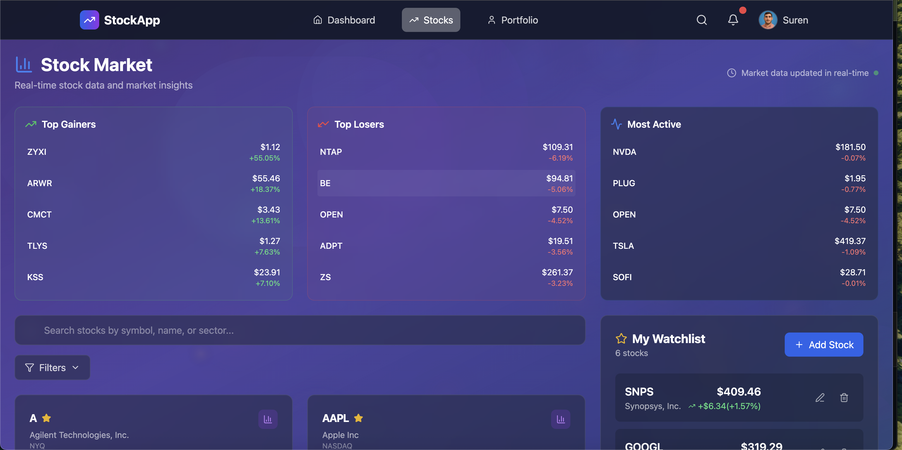
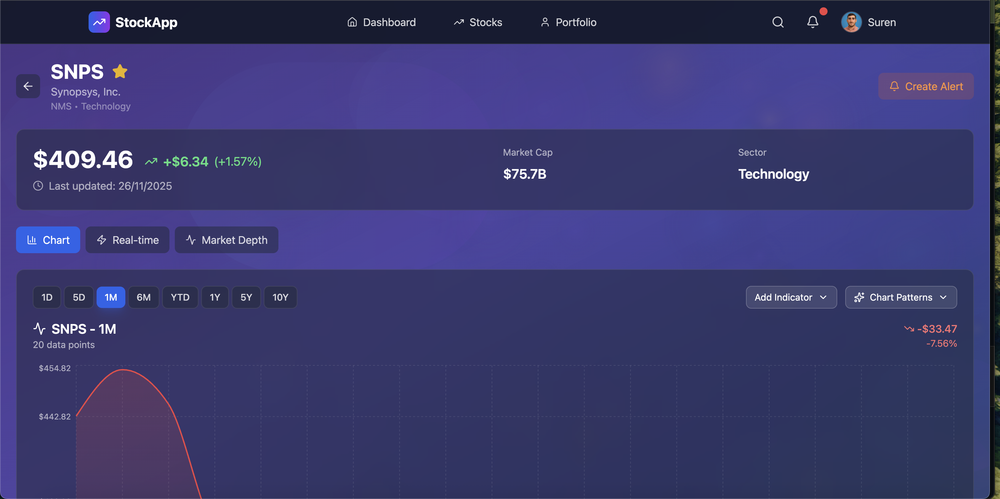
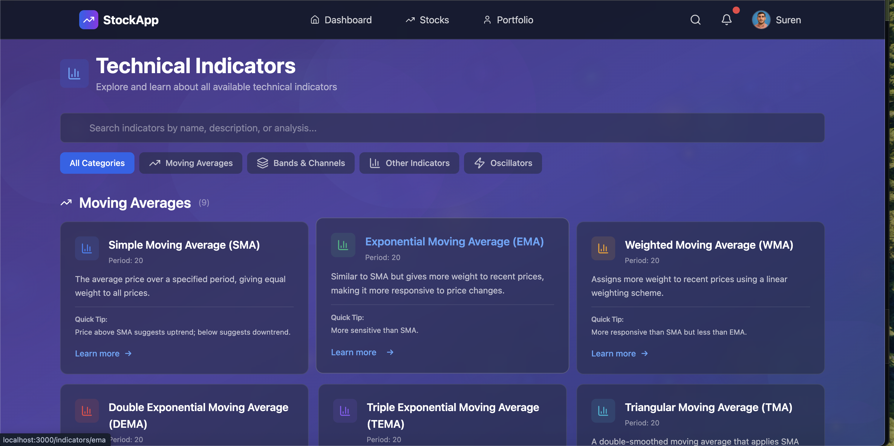
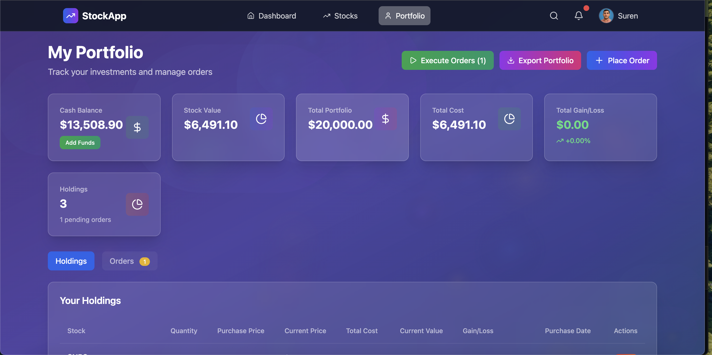
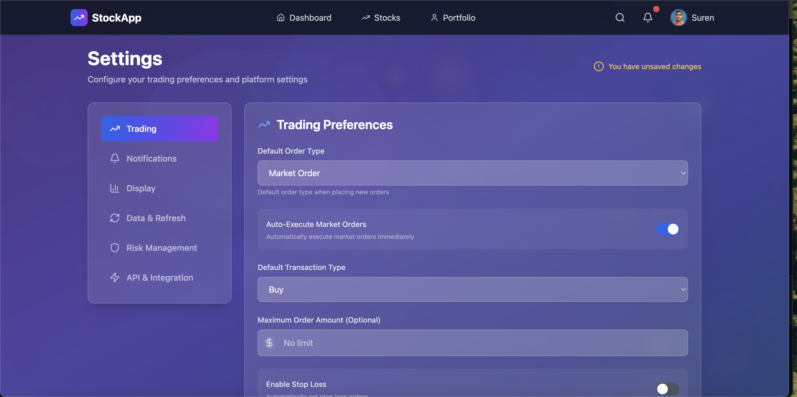
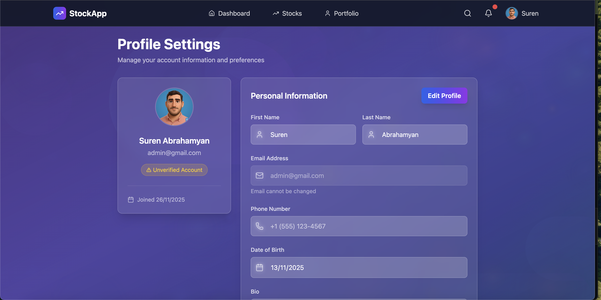

# 📈 StockApp - Full-Stack Stock Market Application

A modern, production-ready full-stack application for stock market data management with a beautiful React frontend and comprehensive Django REST API backend.

## 🛠️ Tech Stack Badges


## 🏗️ Project Overview

This is a full-stack application featuring a React TypeScript frontend with a Django REST API backend, including:

- **Stock Trading Platform** - Buy/sell orders, portfolio management, real-time data
- **Stock Analysis** - Technical indicators, chart patterns, historical data
- **User Management** - Authentication, profiles, settings, support requests
- **Order Management** - Market and target orders with automatic execution
- **Portfolio Tracking** - Real-time portfolio value, gain/loss tracking

## 🎨 Frontend Features

- **Modern React UI** with TypeScript and Tailwind CSS
- **Perplexity-Style Animated Background** with floating orbs and gradients
- **Glass-Morphism Design** with beautiful visual effects
- **Complete Authentication System** (Login/Register/Profile Management)
- **Portfolio Management** - View holdings, place orders, track performance
- **Order Management** - Create, execute, and track buy/sell orders
- **Settings Page** - Comprehensive trading preferences and platform settings
- **Contact Support** - Submit support requests with error tracking
- **PDF Export** - Export portfolio and orders data as PDFs
- **Responsive Design** optimized for all devices
- **Smooth Animations** with Framer Motion
- **Form Validation** with React Hook Form and Zod

## 🔧 Backend Features

- **Custom User Management System** with email-based authentication
- **RESTful API** with comprehensive endpoints
- **Stock Data Management** - Historical prices, intraday data, real-time quotes
- **Order Execution System** - Automatic order execution with error handling
- **Portfolio Management** - Cash balance, holdings, weighted average pricing
- **Support Request System** - User support ticket management
- **Multi-Environment Docker Setup** (Development, Staging, Production, Testing)
- **Modern Code Quality Tools** (Ruff for linting and formatting)
- **Production-Ready Configuration** with security best practices
- **Comprehensive Documentation** and setup guides

## 📸 Screenshots

### Dashboard

*The main dashboard provides a comprehensive overview of your trading activity. It displays your portfolio summary with total value, gains/losses, and cash balance. The watchlist section shows your tracked stocks with real-time price updates. Market summary widgets highlight top gainers, losers, and most active stocks. Quick navigation cards allow easy access to key features like portfolio management, stock browsing, and order placement.*

### Stocks Page

*The stocks page is your gateway to exploring the stock market. Browse through an extensive list of stocks with advanced search and filtering capabilities by exchange, sector, or company name. Each stock card displays key information including current price, market cap, volume, and price change. Interactive elements allow you to quickly add stocks to your watchlist or navigate to detailed stock analysis pages. The responsive grid layout adapts beautifully to any screen size.*

### Stock Details Page

*The stock details page provides in-depth analysis for individual stocks. Features include interactive price charts with multiple time intervals (1m, 5m, 15m, 30m, 1h, 1d), real-time price quotes with bid/ask spreads, market depth visualization showing order book levels, and volume analysis. Historical price data is displayed with OHLCV (Open, High, Low, Close, Volume) information. You can add the stock to your watchlist, set price alerts, and view comprehensive company information all in one place.*

### Indicators Page

*The indicators page showcases technical analysis tools for stock evaluation. Browse through various technical indicators such as Moving Averages (MA, EMA, SMA), Relative Strength Index (RSI), MACD, Bollinger Bands, and more. Each indicator includes detailed explanations, calculation methods, and interpretation guidelines. Select any indicator to view detailed analysis, historical performance, and how to use it in your trading strategy. This page helps traders make informed decisions based on technical analysis.*

### Patterns Page

*The patterns page displays chart patterns that can help identify potential trading opportunities. Explore common patterns like Head and Shoulders, Double Tops/Bottoms, Triangles, Flags, and Pennants. Each pattern includes visual examples, formation criteria, and trading implications. Click on any pattern to see detailed explanations, historical examples, and how to identify these patterns in real market data. This resource is essential for pattern-based trading strategies.*

### Portfolio Page

*The portfolio page is your complete trading command center. View all your holdings with detailed information including purchase price, current value, gain/loss percentages, and weighted average cost. Manage your orders with a comprehensive order history showing executed, pending, and cancelled orders. Place new buy or sell orders directly from this page. Track your portfolio performance over time with visual charts. Export your portfolio and order data as PDFs for record-keeping. The page also displays your cash balance and available funds for trading.*

### Settings Page

*The settings page allows you to customize your trading experience and platform preferences. Configure trading preferences including default order types, position sizing, and risk management parameters. Set up notification preferences for price alerts, order executions, and market updates. Customize display options such as chart themes, data refresh intervals, and default timeframes. Manage your account security settings, API keys, and data export preferences. All settings are automatically saved and synced across your devices.*

### Profile Page

*The profile page lets you manage your personal account information. Update your personal details including name, email, and contact information. Upload and manage your profile avatar with image cropping and preview. Change your password and manage security settings. View your account statistics including registration date, total trades, and account activity. Access account verification status and subscription information. This page ensures you have full control over your account settings and personal information.*

## 🛠️ Tech Stack

### Frontend
- **React 19** with TypeScript
- **Vite** for fast development and builds
- **Tailwind CSS** for styling
- **Framer Motion** for animations
- **React Router** for navigation
- **React Hook Form** with Zod validation
- **Axios** for API communication
- **React Hot Toast** for notifications
- **jsPDF** for PDF generation

### Backend
- **Django 5.2.8** with Django REST Framework 3.16.1
- **PostgreSQL** (Production/Staging), SQLite (Development/Testing)
- **Redis** for caching
- **Nginx** (Production), Gunicorn (WSGI)
- **Docker & Docker Compose** for containerization
- **Ruff** for code quality
- **Prometheus & Grafana** for monitoring
- **Python 3.13+**

## 📁 Project Structure

```
stocks/
├── 📁 frontend/                  # React TypeScript frontend
│   ├── 📁 src/
│   │   ├── 📁 components/        # Reusable UI components
│   │   │   ├── 📁 auth/          # Authentication components
│   │   │   ├── 📁 layout/        # Layout components
│   │   │   └── PerplexityBackground.tsx
│   │   ├── 📁 contexts/          # React contexts
│   │   ├── 📁 lib/               # API client and utilities
│   │   ├── 📁 pages/             # Page components
│   │   └── App.tsx               # Main app component
│   ├── package.json              # Frontend dependencies
│   ├── tailwind.config.js        # Tailwind configuration
│   └── vite.config.ts            # Vite configuration
├── 📁 config/                    # Django configuration
│   ├── 📁 settings/              # Environment-specific settings
│   │   ├── base.py              # Base settings
│   │   ├── development.py       # Development settings
│   │   ├── staging.py           # Staging settings
│   │   ├── production.py        # Production settings
│   │   └── testing.py           # Testing settings
│   ├── urls.py                  # Main URL configuration
│   ├── wsgi.py                  # WSGI configuration
│   └── asgi.py                  # ASGI configuration
├── 📁 users/                     # User management app
│   ├── models.py                # Custom User & UserProfile models
│   ├── serializers.py           # DRF serializers
│   ├── views.py                 # API views and ViewSets
│   ├── admin.py                 # Django admin configuration
│   └── urls.py                  # User app URLs
├── 📁 stocks/                    # Stock management app
│   ├── models.py                # Stock, Order, Portfolio models
│   ├── serializers.py           # DRF serializers
│   ├── views.py                 # API views
│   ├── admin.py                 # Django admin configuration
│   ├── 📁 management/commands/   # Management commands
│   └── urls.py                  # Stock app URLs
├── 📁 scripts/                   # Management scripts
│   ├── docker-dev.sh            # Development Docker commands
│   ├── docker-prod.sh            # Production Docker commands
│   ├── docker-test.sh            # Testing Docker commands
│   ├── dev-local.sh              # Local development launcher
│   └── lint.sh                   # Code quality script
├── 📁 nginx/                     # Nginx configurations
├── 📁 monitoring/                # Monitoring configurations
├── 📁 templates/                 # Django templates
├── 📁 static/                    # Static files
├── 📁 media/                     # User uploads
├── 🐳 Dockerfile                # Multi-stage Docker build
├── 🐳 docker-compose*.yml        # Docker Compose configurations
├── 📋 pyproject.toml            # Python dependencies & Ruff config
└── 📁 docs/                     # Documentation
    ├── FRONTEND_FEATURES.md     # Frontend features documentation
    ├── BACKGROUND_JOBS.md       # Background jobs documentation
    └── 📁 screenshots/          # Application screenshots
```

---

## 🚀 Quick Start Guide

### Prerequisites

**For Local Development (Without Docker):**
- Python 3.13+
- Node.js 18+
- npm or yarn
- uv (automatically installed if missing)

**For Docker Development:**
- Docker Desktop or Docker Engine
- Docker Compose

**For Production:**
- Docker & Docker Compose
- Domain name (optional)
- SSL certificates (for HTTPS)

---

## 💻 Local Development Setup (Without Docker)

### Step 1: Clone the Repository

```bash
git clone <your-repository-url>
cd revs_ai
```

### Step 2: Install Python Dependencies

```bash
# Install uv (fast Python package manager)
pip install uv

# Install project dependencies
uv sync

### Step 3: Install Node.js and npm

If you don't have Node.js and npm installed, follow these instructions:

**macOS (using Homebrew):**
```bash
# Install Homebrew if you don't have it
/bin/bash -c "$(curl -fsSL https://raw.githubusercontent.com/Homebrew/install/HEAD/install.sh)"

# Install Node.js (includes npm)
brew install node

# Verify installation
node --version
npm --version
```

**Ubuntu/Debian:**
```bash
# Update package index
sudo apt update

# Install Node.js and npm
sudo apt install nodejs npm

# Verify installation
node --version
npm --version
```

**Windows:**
1. Download the Node.js installer from [nodejs.org](https://nodejs.org/)
2. Run the installer and follow the setup wizard
3. Verify installation in Command Prompt or PowerShell:
   ```bash
   node --version
   npm --version
   ```

**Alternative: Using nvm (Node Version Manager) - Recommended**

nvm allows you to easily switch between Node.js versions:

**macOS/Linux:**
```bash
# Install nvm
curl -o- https://raw.githubusercontent.com/nvm-sh/nvm/v0.39.0/install.sh | bash

# Restart terminal or source the profile
source ~/.bashrc  # or ~/.zshrc

# Install Node.js 18+ (LTS version)
nvm install --lts
nvm use --lts

# Verify installation
node --version
npm --version
```

**Windows (nvm-windows):**
1. Download nvm-windows from [github.com/coreybutler/nvm-windows/releases](https://github.com/coreybutler/nvm-windows/releases)
2. Install the `nvm-setup.exe` file
3. Open a new Command Prompt or PowerShell window
4. Install Node.js:
   ```bash
   nvm install lts
   nvm use lts
   ```

### Step 4: Install Frontend Dependencies

```bash
cd frontend
npm install
cd ..
mkdir logs
```

### Step 4: Configure Environment

```bash
# Copy environment file
cp env.example .env

# Edit .env file with your settings (optional for development)
# For development, defaults work fine
```

### Step 5: Database Setup

**Option A: SQLite (Default - Simplest)**
```bash
# SQLite is configured by default, no additional setup needed
```

**Option B: PostgreSQL (Recommended for Production-like Setup)**
```bash
# Install PostgreSQL
# macOS:
brew install postgresql
brew services start postgresql

# Ubuntu/Debian:
sudo apt-get install postgresql postgresql-contrib
sudo systemctl start postgresql

# Create database
sudo -u postgres psql
CREATE DATABASE stocks_dev;
CREATE USER stocks_user WITH PASSWORD 'your_password';
GRANT ALL PRIVILEGES ON DATABASE stocks_dev TO stocks_user;
\q

# Update .env file with database credentials
```

### Step 6: Run Migrations

```bash
# Set Django settings (if not using default)
export DJANGO_SETTINGS_MODULE=config.settings.development

# Run migrations
uv run python manage.py migrate

# Create superuser
uv run python manage.py createsuperuser
```

### Step 7: Collect Static Files

```bash
uv run python manage.py collectstatic --noinput
```

### Step 8: Start Development Servers

**Option 1: Using the Development Script (Recommended)**
```bash
# Make script executable
chmod +x scripts/dev-local.sh

# Run the script (starts both backend and frontend)
./scripts/dev-local.sh
```

**Option 2: Manual Start**

**Terminal 1 - Backend:**
```bash
uv run python manage.py runserver 0.0.0.0:8080
```

**Terminal 2 - Frontend:**
```bash
cd frontend
npm run dev
```

### Step 9: Access the Application

- **React Frontend**: http://localhost:3000
- **Django API**: http://localhost:8080
- **Django Admin**: http://localhost:8080/admin/
- **API Documentation**: http://localhost:8080/api/v1/

### Default Credentials

After creating superuser:
- **Email**: (your superuser email)
- **Password**: (your superuser password)

---

## 🐳 Local Development Setup (With Docker)

### Step 1: Clone the Repository

```bash
git clone <your-repository-url>
cd stocks
```

### Step 2: Configure Environment

```bash
# Copy environment file
cp env.example env.development

# Edit env.development if needed (defaults work for development)
```

### Step 3: Start Docker Services

```bash
# Make script executable
chmod +x scripts/docker-dev.sh

# Start all services (backend, database, redis, etc.)
./scripts/docker-dev.sh up
```

This will:
- Build Docker images
- Start PostgreSQL database
- Start Redis cache
- Start Django development server
- Run migrations automatically
- Start MailHog (email testing) and pgAdmin (database management)

### Step 4: Create Superuser

```bash
# In a new terminal
./scripts/docker-dev.sh createsuperuser
```

### Step 5: Install Node.js and npm (If Not Already Installed)

The frontend runs on your local machine (not in Docker), so you need Node.js and npm installed. If you haven't installed them yet, follow the instructions in **Step 3** of the "Local Development Setup (Without Docker)" section above.

**Quick check:**
```bash
node --version
npm --version
```

If these commands fail, install Node.js and npm using one of the methods described in Step 3 above.

### Step 6: Install and Start Frontend (Separate Terminal)

```bash
cd frontend
npm install
npm run dev
```

### Step 7: Access the Application

- **React Frontend**: http://localhost:3000
- **Django API**: http://localhost:8080
- **Django Admin**: http://localhost:8080/admin/
- **PostgreSQL**: localhost:5432
- **Redis**: localhost:6379
- **MailHog (Email Testing)**: http://localhost:8025
- **pgAdmin (Database Management)**: http://localhost:5050
  - Email: admin@stocks.com
  - Password: admin

### Useful Docker Commands

```bash
# View logs
./scripts/docker-dev.sh logs              # All services
./scripts/docker-dev.sh logs web          # Django only

# Access container shell
./scripts/docker-dev.sh shell

# Run Django management commands
./scripts/docker-dev.sh manage <command>  # e.g., migrate, createsuperuser

# Stop services
./scripts/docker-dev.sh down

# Restart services
./scripts/docker-dev.sh restart
```

---

## 🚀 Production Deployment

> 📖 **For a complete step-by-step guide to deploy on DigitalOcean (No Docker), see [DEPLOYMENT_NO_DOCKER.md](docs/DEPLOYMENT_NO_DOCKER.md)**
>
> 📖 **For Docker-based deployment, see [DEPLOYMENT.md](docs/DEPLOYMENT.md)**

This section provides a quick overview. For detailed instructions, refer to the [complete deployment guide](docs/DEPLOYMENT_NO_DOCKER.md).

### Quick Setup (No Docker)

**On your local machine (first time):**
```bash
# Configure deployment settings
./scripts/init-deploy-config.sh
```

**On your DigitalOcean droplet:**
```bash
# 1. Clone repository
git clone https://github.com/surenab/revs_ai.git
cd revs_ai

# 2. Run server setup (installs all dependencies)
./scripts/setup-server.sh

# 3. Configure environment
cp env.example .env.production
nano .env.production

# 4. Set up application
./scripts/setup-app.sh

# 5. Set up services
./scripts/setup-services.sh

# 6. Configure Nginx
./scripts/setup-nginx.sh
```

**Back on your local machine:**
```bash
# 7. Build and upload frontend
./scripts/upload-frontend.sh
```

**Back on server:**
```bash
# 8. Deploy
./scripts/deploy.sh

# 9. Set up SSL (if you have domain)
sudo certbot --nginx -d your-domain.com
```

### Updating After Git Pull

**Backend only:**
```bash
# On server
cd ~/apps/revs_ai
git pull
./scripts/deploy-backend.sh
```

**Frontend only:**
```bash
# On local machine
./scripts/upload-frontend.sh

# On server
cd ~/apps/revs_ai
./scripts/deploy.sh
```

**Both:**
```bash
# On local machine
./scripts/upload-frontend.sh

# On server
cd ~/apps/revs_ai
git pull
./scripts/deploy.sh
```

### Quick Deployment

```bash
# Use the automated deployment script
./scripts/deploy-production.sh
```

### Step 1: Prepare Production Environment

```bash
# Clone repository on production server
git clone <your-repository-url>
cd stocks

# Copy and configure production environment
cp env.example env.production

# Edit env.production with production values:
# - SECRET_KEY (generate a strong secret key)
# - DEBUG=False
# - ALLOWED_HOSTS=your-domain.com,www.your-domain.com
# - Database credentials
# - Email configuration
# - SSL certificate paths
```

### Step 2: Generate Secret Key

```bash
python -c "from django.core.management.utils import get_random_secret_key; print(get_random_secret_key())"
```

Add this to `env.production` as `SECRET_KEY`.

### Step 3: Configure SSL Certificates (Optional but Recommended)

```bash
# Create SSL directory
mkdir -p ssl

# Place your SSL certificates:
# - ssl/cert.pem (SSL certificate)
# - ssl/key.pem (Private key)
# - ssl/chain.pem (Certificate chain, if needed)
```

### Step 4: Build and Start Production Services

```bash
# Make script executable
chmod +x scripts/docker-prod.sh

# Start production services
./scripts/docker-prod.sh up
```

This will:
- Build production Docker images
- Start PostgreSQL database
- Start Redis cache
- Start Django with Gunicorn
- Start Nginx reverse proxy
- Run migrations automatically
- Collect static files

### Step 5: Initial Setup

```bash
# Create superuser
./scripts/docker-prod.sh shell
python manage.py createsuperuser
exit

# Verify services are running
./scripts/docker-prod.sh status
```

### Step 6: Configure Domain and DNS

1. Point your domain to the server's IP address
2. Update `ALLOWED_HOSTS` in `env.production` with your domain
3. Restart services: `./scripts/docker-prod.sh restart`

### Step 7: Set Up Monitoring (Optional)

```bash
# Access monitoring services
# Prometheus: http://your-domain:9090
# Grafana: http://your-domain:3001
```

### Production Management Commands

```bash
# View logs
./scripts/docker-prod.sh logs

# Create database backup
./scripts/docker-prod.sh backup

# Restore from backup
./scripts/docker-prod.sh restore <backup-file>

# Update deployment
git pull
./scripts/docker-prod.sh up --build

# Renew SSL certificates (if using Let's Encrypt)
./scripts/docker-prod.sh ssl-renew

# Check service status
./scripts/docker-prod.sh status
```

### Step 8: Set Up Automated Backups (Recommended)

Add to crontab:
```bash
# Daily backup at 2 AM
0 2 * * * cd /path/to/stocks && ./scripts/docker-prod.sh backup
```

---

## 🔧 Django Management Commands

All management commands are located in `stocks/management/commands/`.

### Stock Data Management

#### 1. `populate_real_stocks` - Populate Stock Database

Populates the database with real stock symbols and company information from Yahoo Finance.

```bash
# Add popular stocks from all sectors (~500 stocks)
python manage.py populate_real_stocks --popular

# Add specific stocks by symbols
python manage.py populate_real_stocks --symbols AAPL,GOOGL,MSFT,TSLA,AMZN

# Add stocks by sector
python manage.py populate_real_stocks --tech          # Technology stocks
python manage.py populate_real_stocks --biotech       # Biotech & medical stocks
python manage.py populate_real_stocks --energy        # Energy sector stocks
python manage.py populate_real_stocks --finance      # Financial sector stocks
python manage.py populate_real_stocks --consumer      # Consumer goods stocks

# Advanced options
python manage.py populate_real_stocks --popular --batch-size 20 --delay 1.0
python manage.py populate_real_stocks --symbols AAPL,GOOGL --force --dry-run

# Docker usage
./scripts/docker-dev.sh manage populate_real_stocks --popular
```

**Options:**
- `--symbols` - Comma-separated list of specific symbols to add
- `--popular` - Add popular stocks from all categories (~500 stocks)
- `--tech` - Add top 100 technology stocks
- `--biotech` - Add top 100 biotech and medical stocks
- `--energy` - Add top 100 energy sector stocks
- `--finance` - Add top 100 financial sector stocks
- `--consumer` - Add top 100 consumer goods stocks
- `--batch-size` - Number of stocks to process per batch (default: 10)
- `--delay` - Delay between batches in seconds (default: 0.5)
- `--force` - Force update existing stocks
- `--dry-run` - Show what would be done without making changes

#### 2. `sync_historical_data` - Sync Historical Stock Prices

Fetches and stores historical daily stock price data from Yahoo Finance.

```bash
# Sync historical data for all active stocks (last 10 years)
python manage.py sync_historical_data

# Sync specific stocks
python manage.py sync_historical_data --symbols AAPL,GOOGL,MSFT

# Different time periods
python manage.py sync_historical_data --period 1y      # Last 1 year
python manage.py sync_historical_data --period 5y     # Last 5 years
python manage.py sync_historical_data --period max     # All available data
python manage.py sync_historical_data --period ytd    # Year to date

# Different intervals
python manage.py sync_historical_data --interval 1d   # Daily (default)
python manage.py sync_historical_data --interval 1wk  # Weekly
python manage.py sync_historical_data --interval 1mo  # Monthly

# Advanced options
python manage.py sync_historical_data --batch-size 5 --delay 2.0 --force

# Docker usage
./scripts/docker-dev.sh manage sync_historical_data --period 1y
```

**Options:**
- `--symbols` - Comma-separated list of symbols to sync
- `--period` - Time period: `1d`, `5d`, `1mo`, `3mo`, `6mo`, `1y`, `2y`, `5y`, `10y`, `ytd`, `max`
- `--interval` - Data interval: `1d`, `5d`, `1wk`, `1mo`, `3mo`
- `--batch-size` - Number of stocks to process per batch (default: 5)
- `--delay` - Delay between batches in seconds (default: 1.0)
- `--force` - Force update existing data
- `--dry-run` - Show what would be done without making changes

#### 3. `sync_daily_intraday` - Sync Intraday Stock Data

Fetches and stores intraday (sub-daily) stock price data for real-time analysis.

```bash
# Sync intraday data for all active stocks (5-minute intervals)
python manage.py sync_daily_intraday

# Different intervals
python manage.py sync_daily_intraday --interval 1m     # 1-minute intervals
python manage.py sync_daily_intraday --interval 5m    # 5-minute intervals (default)
python manage.py sync_daily_intraday --interval 15m   # 15-minute intervals
python manage.py sync_daily_intraday --interval 1h    # 1-hour intervals

# Specific stocks
python manage.py sync_daily_intraday --symbols AAPL,GOOGL --interval 1m

# Different periods
python manage.py sync_daily_intraday --period 1d      # Current day (default)
python manage.py sync_daily_intraday --period 5d      # Last 5 days
python manage.py sync_daily_intraday --period 1mo     # Last month

# Advanced options
python manage.py sync_daily_intraday --batch-size 10 --delay 0.5 --force

# Docker usage
./scripts/docker-dev.sh manage sync_daily_intraday --interval 1m
```

**Options:**
- `--symbols` - Comma-separated list of symbols to sync
- `--interval` - Time interval: `1m`, `2m`, `5m`, `15m`, `30m`, `60m`, `90m`, `1h`
- `--period` - Data period: `1d`, `5d`, `1mo`
- `--batch-size` - Number of stocks to process per batch (default: 10)
- `--delay` - Delay between batches in seconds (default: 0.5)
- `--force` - Force update existing data for today
- `--dry-run` - Show what would be done without making changes

#### 4. `update_tick_data_batch` - Update Tick Data

Updates real-time tick data for all active stock symbols using batch processing.

```bash
# Update tick data for current day
python manage.py update_tick_data_batch

# Specific stocks
python manage.py update_tick_data_batch --symbols AAPL,GOOGL,MSFT

# Limit number of stocks
python manage.py update_tick_data_batch --limit 50

# Batch size configuration
python manage.py update_tick_data_batch --batch-size 30

# Docker usage
./scripts/docker-dev.sh manage update_tick_data_batch
```

**Options:**
- `--symbols` - Comma-separated list of symbols to update
- `--batch-size` - Number of symbols to process per batch (default: 50)
- `--limit` - Maximum number of symbols to process
- `--dry-run` - Show what would be done without making changes

#### 5. `delete_stocks_without_data` - Clean Up Stocks

Deletes stock symbols that do not have any price data.

```bash
# Show what would be deleted (dry run)
python manage.py delete_stocks_without_data --dry-run

# Delete stocks without data
python manage.py delete_stocks_without_data

# Force delete without confirmation
python manage.py delete_stocks_without_data --force

# Delete stocks with less than minimum days of data
python manage.py delete_stocks_without_data --min-days 30

# Docker usage
./scripts/docker-dev.sh manage delete_stocks_without_data --dry-run
```

**Options:**
- `--dry-run` - Show what would be deleted without actually deleting
- `--force` - Skip confirmation prompt
- `--min-days` - Minimum days of data required (default: 0)

#### 6. `setup_periodic_tasks` - Configure Automated Data Sync

Sets up Celery periodic tasks for automated stock data synchronization.

```bash
# Set up all periodic tasks
python manage.py setup_periodic_tasks

# Clear existing tasks and create new ones
python manage.py setup_periodic_tasks --clear

# Docker usage
./scripts/docker-dev.sh manage setup_periodic_tasks
```

**Options:**
- `--clear` - Clear existing periodic tasks before creating new ones

**Created Tasks:**
- **Hourly Intraday Sync** - Syncs 5-minute intraday data every hour during market hours
- **Daily Historical Sync** - Syncs daily historical data every day at 6 PM EST
- **Weekly Full Sync** - Complete data synchronization every Sunday at 2 AM

### Complete Setup Workflow

```bash
# 1. Populate database with stocks
python manage.py populate_real_stocks --popular

# 2. Sync historical data (last 2 years)
python manage.py sync_historical_data --period 2y

# 3. Sync current day intraday data
python manage.py sync_daily_intraday --interval 5m

# 4. Set up automated tasks
python manage.py setup_periodic_tasks
```

### Daily Operations

```bash
# Morning: Sync overnight data
python manage.py sync_historical_data --period 5d --force

# During market hours: Update intraday data
python manage.py sync_daily_intraday --interval 1m --force

# Evening: Full daily sync
python manage.py sync_historical_data --period 1d --force
```

### Maintenance Operations

```bash
# Add new stocks
python manage.py populate_real_stocks --symbols NVDA,AMD,INTC

# Backfill historical data for new stocks
python manage.py sync_historical_data --symbols NVDA,AMD,INTC --period max

# Update existing data
python manage.py sync_historical_data --force --period 1mo

# Clean up stocks without data
python manage.py delete_stocks_without_data --dry-run
```

---

## 📡 API Endpoints

### Authentication Endpoints

```bash
POST   /api/v1/auth/register/              # User registration
POST   /api/v1/auth/login/                 # User login
POST   /api/v1/auth/logout/                # User logout
POST   /api/v1/auth/password-reset/        # Request password reset
POST   /api/v1/auth/password-reset-confirm/<uid>/<token>/  # Confirm password reset
```

### User Management Endpoints

```bash
GET    /api/v1/users/                      # List users (staff only)
GET    /api/v1/users/me/                   # Get current user profile
PUT    /api/v1/users/me/                   # Update current user profile
PATCH  /api/v1/users/me/                   # Partial update current user
POST   /api/v1/users/change_password/      # Change password
GET    /api/v1/users/{id}/                 # Get user details (staff only)
POST   /api/v1/users/{id}/verify_user/     # Verify user (admin only)
POST   /api/v1/users/{id}/deactivate_user/ # Deactivate user (admin only)
POST   /api/v1/users/support/              # Submit support request
```

### Stock Endpoints

```bash
GET    /api/v1/stocks/stocks/              # List all stocks
GET    /api/v1/stocks/stocks/<symbol>/     # Get stock details
GET    /api/v1/stocks/stocks/<symbol>/timeseries/  # Get time series data
GET    /api/v1/stocks/search/              # Search stocks
GET    /api/v1/stocks/market-summary/       # Get market summary
```

### Portfolio Endpoints

```bash
GET    /api/v1/stocks/portfolio/           # Get user portfolio
GET    /api/v1/stocks/portfolio/summary/   # Get portfolio summary
POST   /api/v1/stocks/portfolio/add-funds/ # Add funds to cash balance
```

### Order Endpoints

```bash
GET    /api/v1/stocks/orders/              # List user orders
POST   /api/v1/stocks/orders/              # Create new order
GET    /api/v1/stocks/orders/<id>/         # Get order details
PATCH  /api/v1/stocks/orders/<id>/         # Update order (cancel only)
POST   /api/v1/stocks/orders/execute/      # Execute pending orders
GET    /api/v1/stocks/orders/summary/      # Get order summary
```

---

## 🧪 Testing

### Run Tests

```bash
# All tests
python manage.py test

# Specific app
python manage.py test users
python manage.py test stocks

# With coverage
DJANGO_SETTINGS_MODULE=config.settings.testing uv run pytest --cov=users --cov-report=html

# Docker
./scripts/docker-test.sh all
```

---

## 🔍 Code Quality

### Linting and Formatting

```bash
# Check for issues
uv run ruff check

# Auto-fix issues
uv run ruff check --fix

# Format code
uv run ruff format

# Complete lint and format
./scripts/lint.sh

# Docker
./scripts/docker-dev.sh lint
./scripts/docker-dev.sh format
```

### Pre-commit Hooks

Pre-commit hooks automatically run code quality checks **on every `git commit`**. This ensures that all code is properly formatted and linted before it's committed.

#### Quick Setup

```bash
# Run the setup script (recommended)
./scripts/setup-pre-commit.sh

# Or manually:
uv sync --all-groups
uv run pre-commit install
```

#### Manual Setup

```bash
# Install pre-commit (if not already installed)
uv sync --all-groups

# Install the git hooks (this makes pre-commit run on commit)
uv run pre-commit install

# Run pre-commit on all files (optional, for testing)
uv run pre-commit run --all-files

# Update pre-commit hooks (when .pre-commit-config.yaml changes)
uv run pre-commit autoupdate
```

#### How It Works

Once installed with `pre-commit install`, the hooks will **automatically run on every `git commit`**. The hooks will:

- Format code with `ruff format` (auto-fixes formatting)
- Check and fix linting issues with `ruff check` (auto-fixes when possible)
- Check for trailing whitespace
- Ensure files end with a newline
- Validate YAML, JSON, and TOML files
- Check for merge conflict markers
- Check for debug statements

**Note:**
- If pre-commit hooks fail, the commit will be **blocked**. Fix the issues and try committing again.
- The hooks will auto-format your code when possible, but you may need to stage the changes and commit again.
- Test files are automatically excluded from linting checks.

---

## 🛠️ Troubleshooting

### Common Issues

#### Port Already in Use
```bash
# Check what's using port 8080
lsof -i :8080

# Kill the process
kill -9 <PID>

# Or use different port
python manage.py runserver 8001
```

#### Database Connection Issues
```bash
# Check database status (Docker)
./scripts/docker-dev.sh logs db

# Check database status (Local PostgreSQL)
pg_isready -h localhost -p 5432

# Reset database (Docker - development only)
./scripts/docker-dev.sh down
docker volume rm stocks_postgres_data
./scripts/docker-dev.sh up
```

#### Migration Issues
```bash
# Create migrations
python manage.py makemigrations

# Apply migrations
python manage.py migrate

# Docker
./scripts/docker-dev.sh makemigrations
./scripts/docker-dev.sh migrate
```

#### Docker Issues
```bash
# Clean Docker cache
docker system prune -a

# Rebuild containers
./scripts/docker-dev.sh down
docker-compose -f docker-compose.yml -f docker-compose.development.yml build --no-cache
./scripts/docker-dev.sh up
```

---

## 📄 License

**View-Only License**

This project is provided for viewing purposes only. You may NOT:

- Use, copy, modify, or distribute this project or any part of it
- Use this project for any commercial or non-commercial purposes
- Fork, clone, or reproduce this project for any purpose
- Create derivative works based on this project
- Use any code, design, or content from this project

**All rights reserved.** This project is strictly for viewing and educational reference only. Any unauthorized use, reproduction, or distribution is strictly prohibited.

---

## 🆘 Support

If you encounter any issues or have questions:

1. **Check the troubleshooting section** above
2. **Review the documentation** files in the `docs/` folder:
   - [Frontend Features](docs/FRONTEND_FEATURES.md) - Complete frontend feature overview
   - [Background Jobs](docs/BACKGROUND_JOBS.md) - Background job system documentation
3. **Check existing issues** in the repository
4. **Submit a support request** through the application's Contact Support page
5. **Create a new issue** with detailed information

---

**Happy coding! 🚀**
